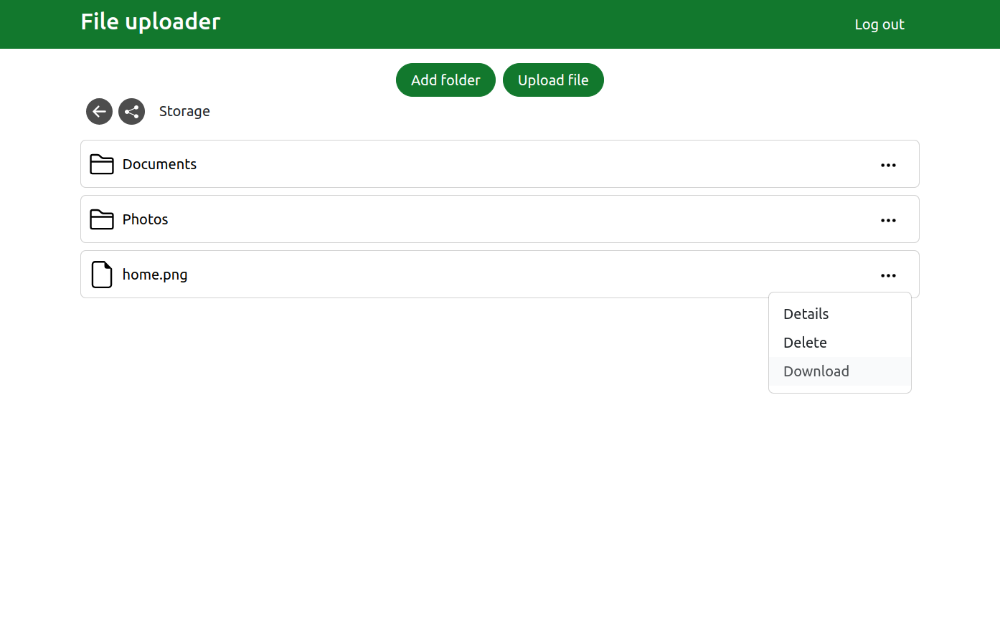

# File uploader

Express application which requires authentication and allows the user to create folders and upload files. Files can be shared using a link for a selected period of time. Folders, files, users and share links are stored in PostgreSQL tables managed using Prisma ORM. Files are stored on a remote server and can be downloaded.

## Technologies used

- Express
- passport-local
- Prisma ORM
- Supastore
- EJS
- Bootstrap

## Screenshot

